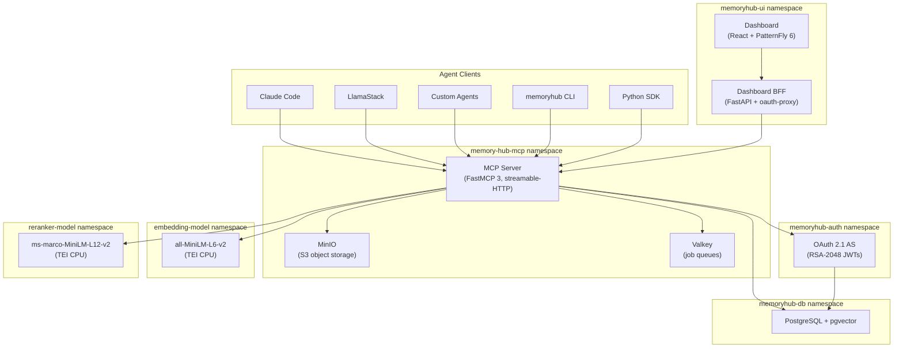

# Deploy MemoryHub on OpenShift AI to give your agents persistent memory

As we all know, when you use an AI model, or a simple agent connected to a model,
the AI doesn't remember anything about the conversations you've had in the past,
which can make a new conversation cumbersome. That's where agent memory systems
come in. Memory is what lets your agent know who you are, learn your preferences,
and adopt rules you give it, such as which package manager you want to use most
of the time, or how you want to sing for the local opera someday, or key points
about a book you're writing. Learning all these things about you makes your agent
more than just a tool. AI can become an integral part of your workflow, so long
as it can learn your workflow and follow it well.

There are lots of agent memory systems available. Some are popular, and many
use the LLM Wiki system made famous by Andrej Karpathy in his now-famous gist
here: https://gist.github.com/karpathy/442a6bf555914893e9891c11519de94f

Many of these systems are great, and solve a specific set of problems. If
you are running an agent on your local laptop, and you want really good agent
memory, then many of these systems solve that problem exceptionally well.

What about when you are running agents in an enterprise? Think of a healthcare
process such as prescription fulfillment, where multiple steps might be managed
by individual agents helping the process go along smoothly, or a factory floor
where advanced manufacturing is run by AI agents. In those situations, we find
that the agents need to be able to share memories among themselves, so that they
can have a sort of "hive mind" and act together to solve problems. Enterprises
employing these types of agent teams also have governance and compliance requirements
such as audit, provenance (how did this memory get in here), role-based access
controls, and the ability for all of this to operate at great scale.

For these needs, there is MemoryHub.

MemoryHub is intended for enterprises who want to run agents at scale, in production,
and have regulatory and cybersecurity requirements that apply to every layer in
the AI application set.

A few key features, and then we'll go install it and explore how it works:

## Memory Storage
MemoryHub stores memories in PostgreSQL+PGVector as a tree-structured memory model.
This differs from many local-first systems which
use markdown, markdown+yaml, or some other file-based system. Files are great
for agent memory and are appropriate in many cases. If your intention is to have
many agents accessing memories, updating them, and deleting them, and you need
to keep track of memory versions, provenance, and support administrative actions
like conflict resolution and deletes, then a database presents itself as the
obvious choice.

In MemoryHub, each memory is a node with metadata. That metadata includes the weight,
which controls how prominently it gets considered in the agent's context.

Memories are organized by scope: user, project, campaign, role, organizational,
and enterprise. An individual developer's preferences live at user scope. A
team's architectural decisions live at project scope. A company-wide security
policy lives at enterprise scope. Agents act in the user's security context, so
they can see what the user is allowed to see. This is enforced by the RBAC controls
in MemoryHub.

Each memory node can carry typed branches. A rationale branch captures why a
decision was made. A provenance branch records where the information came from.
When an agent retrieves a memory, it can optionally follow these branches to understand
context, not just the fact itself.

Content is classified as experiential (learned from interaction), knowledge
(imported facts), or behavioral (patterns of how the user works). This
distinction matters because different content types have different curation
needs. An experiential memory about a user's preference might change from time to time.
A knowledge memory about an API endpoint should be checked for staleness.

The interface is MCP-native. Agents connect using the
[Model Context Protocol](https://modelcontextprotocol.io) they already speak.
Four action-dispatch tools cover the full surface: `register_session` for
authentication, `memory` for all read/write operations, `thread` for
conversation persistence, and `admin_memory` for governance. Any MCP-compatible
client (Claude Code, LlamaStack, custom agents) can connect without an adapter
layer.

## Architecture on OpenShift AI

MemoryHub deploys as a set of microservices across dedicated OpenShift
namespaces:



**Figure 1:** MemoryHub deployment architecture on OpenShift AI.

A few architectural decisions are worth calling out:

**Single database for everything.** PostgreSQL with pgvector handles
relational data, vector similarity search, and graph queries in one place. No
separate vector database or graph database to operate. Schema changes are
managed by Alembic migrations that run automatically during deployment.

**Self-hosted models, no GPU required.** The embedding model
(all-MiniLM-L6-v2, 384 dimensions) and reranker (ms-marco-MiniLM-L12-v2)
both run on Hugging Face Text Embeddings Inference with CPU. The entire
inference pipeline stays inside the cluster with no external API calls and no
GPU scheduling to configure. If you have GPUs available, pass `--gpu-models` to
the installation script for better throughput.

**Minimal SCC footprint.** The MCP server, auth service, and model
serving all run under OpenShift's default `restricted-v2` SCC. PostgreSQL,
MinIO, and Valkey require `anyuid` on their service accounts, which the
installation script grants automatically. No privileged containers.

**Kustomize-native manifests.** Each subsystem has its own `deploy/` directory
with kustomize-structured manifests, ready for integration with ArgoCD or
OpenShift GitOps.

## Prerequisites

- OpenShift 4.x cluster (no GPU required for default CPU deployment)
- `oc` CLI, authenticated to the cluster
- Cluster-admin or namespace-create permissions
- `make` and `git` on your workstation

## Deploy the full stack

Three commands:

```bash
git clone https://github.com/redhat-ai-americas/memory-hub.git
cd memory-hub
make install
```

`make install` runs a single deployment script that creates the namespaces,
bootstraps PostgreSQL, runs schema migrations, deploys MinIO and Valkey, starts
the embedding and reranker models, deploys the MCP server and OAuth
authorization server, brings up the dashboard, and runs a smoke test. The whole
process takes about ten minutes on a typical cluster.

The installation script generates API keys automatically and prints them at the end.
You'll need the API key to connect agents.

If your cluster has GPUs available, deploy with GPU-accelerated models instead:

```bash
make install ARGS="--gpu-models"
```

To verify everything is running:

```bash
oc get pods --context <your-context> -n memory-hub-mcp
oc get pods --context <your-context> -n memoryhub-db
oc get pods --context <your-context> -n memoryhub-auth
oc get pods --context <your-context> -n memoryhub-ui
```

## Connect your agents

MemoryHub exposes three client interfaces. Pick the one that fits your
workflow.

### MCP (native agent protocol)

Any MCP-compatible agent can connect directly. For Claude Code:

```bash
claude mcp add memoryhub -- memoryhub mcp
```

The agent discovers the tools automatically. A typical interaction looks like
this: the agent calls `register_session` with an API key, then uses the
`memory` tool to search, write, read, and update memories. No adapter code
needed.

### Python SDK

For programmatic access from your own agents or pipelines:

```bash
pip install memoryhub
```

```python
from memoryhub import MemoryHubClient

client = MemoryHubClient(
    url="https://your-memoryhub-route/mcp/",
    api_key="mh-dev-..."
)

# Write a memory
client.write_sync(
    "Team prefers FastAPI over Flask for new services",
    scope="project",
    weight=0.8
)

# Search
results = client.search_sync("web framework preferences")
for memory in results:
    print(f"[{memory.weight}] {memory.content}")
```

### CLI

For quick lookups and scripting:

```bash
pip install memoryhub-cli
memoryhub login                             # one-time credential setup
memoryhub search "deployment patterns"
memoryhub write "Use Podman, not Docker" --scope user --weight 0.9
memoryhub read <memory-id>
```

## Try it locally first

If you want to evaluate MemoryHub before deploying to a cluster, there's a
personal edition that runs entirely on your workstation:

```bash
pip install "memoryhub[local]"
claude mcp add memoryhub -- memoryhub mcp
```

This installs a local MCP server backed by SQLite and sqlite-vec. It exposes
the same four-tool MCP surface as the cluster deployment, so agents don't
need to change how they interact. When you're ready for multi-agent, multi-user
deployment with full RBAC and background curation, move to the cluster edition.

## Where it stands

Here's where MemoryHub stands on the
[AMB PersonaMem benchmark](https://huggingface.co/spaces/MARco-o1/AMB),
which measures how well a memory system retains and retrieves information
across long conversations. All systems use Gemini 3.1 Pro Preview as the
answer LLM so the only variable is the memory layer:

| System | PersonaMem 32k | Retrieval Approach |
|--------|---------------|--------------------|
| Hindsight | 86.6% | LLM fact extraction into semantic graph |
| hybrid-search | 84.4% | 512-token chunking, dense+sparse embeddings |
| **MemoryHub (Granite, GPU)** | **83.7%** | Granite embedding + reranker, hybrid search |
| Cognee | 81.8% | Chunking + graph entity extraction |
| **MemoryHub (MiniLM, CPU)** | **81.2%** | all-MiniLM-L6-v2, cosine-only ranking |

Published leaderboard results are shown for other systems; MemoryHub's
score (83.7%) has been submitted and is pending review
([PR #34](https://github.com/vectorize-io/agent-memory-benchmark/pull/34)).

The default CPU install (`make install`) uses MiniLM and scores 81.2%.
The GPU configuration (`make install ARGS="--gpu-models"`) uses Granite
models whose 8192-token context window lets the reranker score full
conversation transcripts instead of falling back to cosine-only ranking,
pushing the score to 83.7%.

We also ran the
[LongMemEval](https://github.com/xiaowu0162/LongMemEval) retrieval
benchmark. MemoryHub achieved R@5=0.999, meaning that in our testing the
relevant memory appeared within the five returned results on nearly
every query.

The project is Apache 2.0 licensed and available at
[github.com/redhat-ai-americas/memory-hub](https://github.com/redhat-ai-americas/memory-hub).
If your team is running agents on OpenShift and wants them to actually learn
from experience rather than starting from zero every session, it's worth
deploying.
