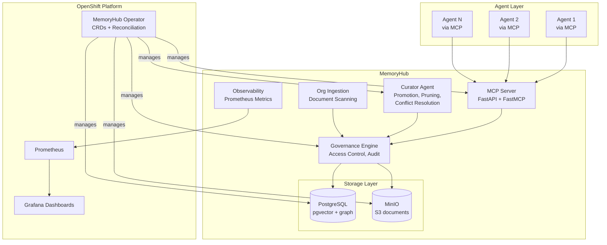
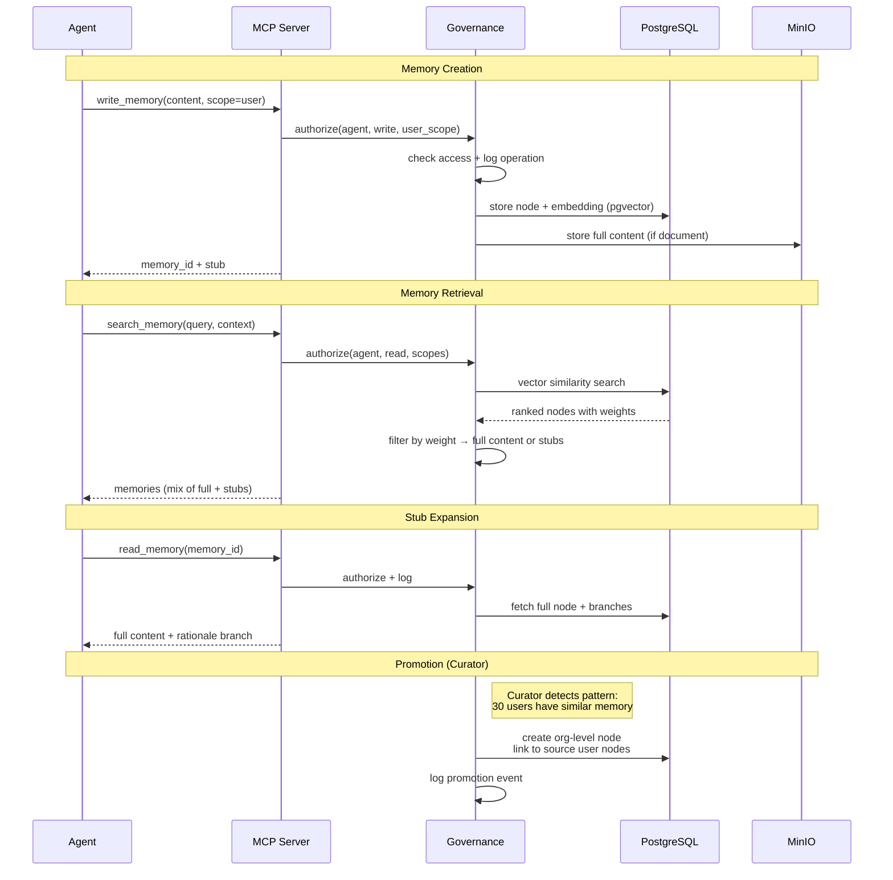
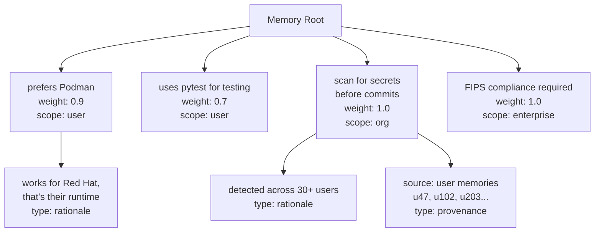
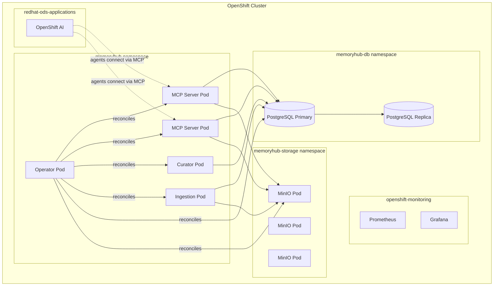

# Architecture

MemoryHub is a Kubernetes-native agent memory system for OpenShift AI. It provides centralized, governed memory that agents interact with via MCP, backed by PostgreSQL and MinIO, managed by a Kubernetes Operator, and observed through Grafana.

This document covers the big picture. Subsystem details live in their own docs (see [SYSTEMS.md](SYSTEMS.md)).

## System Overview

Agents never touch storage directly. Every memory operation flows through the MCP server, which delegates to the governance engine for access control and audit logging before anything hits the storage layer. The curator agent and org ingestion pipeline also go through governance -- no backdoors.

## Data Flow

A memory's lifecycle has several phases. Here's how a typical memory moves through the system, from creation through potential promotion to organizational knowledge.

The weight-based stub system is central to the data flow. When an agent searches for memories, they get back a mix of full content (for high-weight, highly relevant memories) and stubs (for lower-weight memories where full content would bloat the context). The agent decides whether to expand stubs by requesting the full node. This keeps context windows lean while making depth available on demand.

## The Tree-Based Memory Model

Memories are organized as a tree, not a flat list or a layered stack. Each memory is a node that can have child branches -- some required (like scope metadata), some optional (like rationale). This is explained in detail in [memory-tree.md](memory-tree.md), but here's the structural concept:

The weight on each node controls injection behavior. A weight of 1.0 means always inject full content. Lower weights produce stubs. The threshold is configurable per deployment via the Operator's CRDs.

## Integration Points

**MCP Server** is the sole external interface. Agents connect via streamable-http transport. Authentication flows through OpenShift's OAuth. See [mcp-server.md](mcp-server.md).

**Kubernetes API** is how platform administrators interact with MemoryHub. CRDs declare memory tiers, policies, and storage configuration. The operator reconciles desired state. See [operator.md](operator.md).

**PostgreSQL** serves double duty: pgvector for semantic vector search, and either Apache AGE or adjacency list patterns for graph relationships between memory nodes. Both run on the OOTB PostgreSQL operator that ships with OpenShift. See [storage-layer.md](storage-layer.md).

**MinIO** provides S3-compatible object storage for document-sized memories -- markdown files, full procedure documents, anything too large for a database row. See [storage-layer.md](storage-layer.md).

**Grafana + Prometheus** for observability. MemoryHub exports Prometheus metrics; Grafana dashboards visualize memory utilization, staleness, governance events, and (stretch goal) relationship graphs. See [observability.md](observability.md).

## Deployment Topology

MemoryHub deploys to an existing OpenShift AI cluster as a standalone component. It does not require modifications to OpenShift AI itself.

The MCP server pods are horizontally scalable behind a Service. PostgreSQL runs with a primary and at least one replica for HA (managed by the OOTB operator). MinIO runs in distributed mode across multiple pods for durability. The curator and ingestion agents run as single-instance deployments with leader election.

All containers use Red Hat UBI9 base images. FIPS compliance is inherited from the cluster's FIPS mode -- PostgreSQL delegates crypto to OS-level OpenSSL, and MinIO uses Go 1.24's FIPS 140-3 module.

## What's Decided vs. What's Open

Decided: tree-based memory model, PostgreSQL + pgvector + MinIO storage stack, MCP as agent interface, Kubernetes Operator for management, governance tiers, single curator agent for above-user writes, FIPS through OS-level crypto delegation.

Open: PostgreSQL schema design for the tree model, CRD naming and structure, weight calibration strategy, multi-cluster federation, petgraph evolution path timeline, specific Grafana dashboard layouts.

The architecture is designed to let these open questions be resolved incrementally. The core data flow and subsystem boundaries are stable; the internals of each subsystem are where the remaining design work lives.
