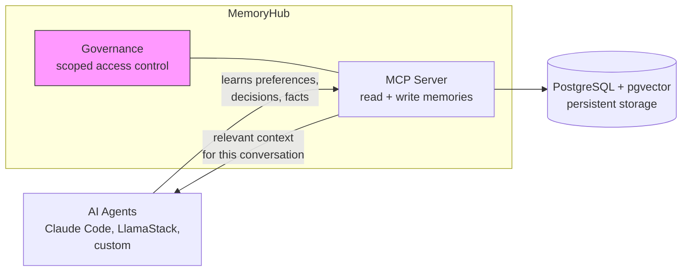
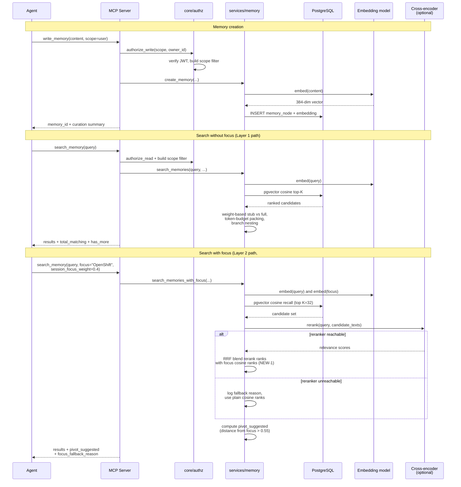
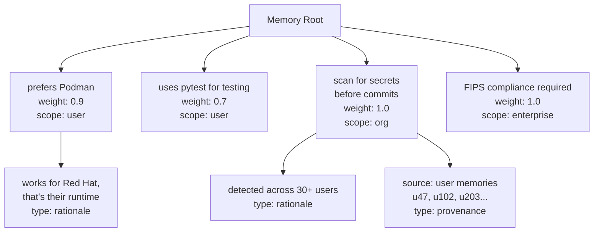
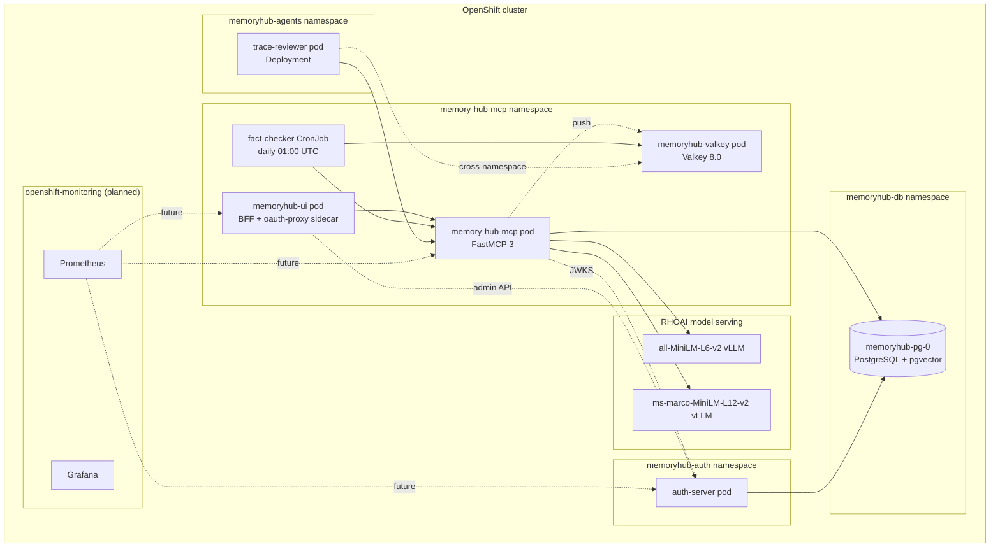

# Architecture

MemoryHub is a Kubernetes-native agent memory system for OpenShift AI. It provides centralized, governed memory behind a single service core -- an MCP server backed by PostgreSQL with pgvector and protected by an OAuth 2.1 authorization server with service-layer RBAC. Consumers reach that core through multiple interchangeable **surfaces**; today those are agents over MCP, a typed Python SDK, a CLI, a dashboard UI, and agent-harness hooks, and the set is expected to grow (e.g., agent plugins, platform connectors).

This document covers the big picture. Subsystem details live in their own docs (see [SYSTEMS.md](SYSTEMS.md)). For the conceptual case — what agent memory is, when local files suffice, and when you need a governed platform — read [What Agent Memory Really Is](guides/what-is-agent-memory.md) first.

One boundary worth stating up front: **MemoryHub is memory, not retrieval.** It stores what agents learned from experience — decisions, preferences, outcomes — not document corpora. "What does the data say?" is the job of whatever RAG stack the organization runs; the division of labor is spelled out in [strategy/platform-architecture.md](../strategy/platform-architecture.md).

## Consumer surfaces

A *surface* is any way a human or agent reaches MemoryHub. Surfaces are deliberately thin: all of them converge on the same MCP server and service layer, which is where authorization, curation, and governance are enforced. No surface talks to PostgreSQL directly.

| Surface | Consumers | Path to the core |
|---|---|---|
| MCP | Agents (Claude Code, LlamaStack, custom) | MCP protocol → MCP server |
| Python SDK (`memoryhub`) | Applications, integrations (e.g. kagenti-adk) | SDK → MCP server |
| CLI (`memoryhub-cli`) | Humans, scripts, agent harnesses | CLI → SDK → MCP server |
| Dashboard UI | Administrators | React frontend → BFF → MCP server |
| Agent-harness hooks | SessionStart / UserPromptSubmit / Stop hooks | Hooks → CLI → SDK → MCP server |

Rules for adding a new surface (a plugin, a platform connector, an editor extension, ...):

1. **Go through the MCP server** — either speak MCP directly or build on the SDK. Never bypass the service layer; RBAC and curation live there.
2. **Authenticate like everyone else** — OAuth 2.1 `client_credentials` (or the dev-path API key shim until it's retired). No new auth mechanisms per surface.
3. **Stay stateless where possible** — server-side session state is the exception, not the rule (see the stateless-focus discussion below).
4. **Register as a consumer** — add the surface to the same-commit consumer audit list in [CONTRIBUTING.md](../CONTRIBUTING.md) if it parses MCP response shapes.

## Conceptual overview

AI agents are stateless by default -- each conversation starts from scratch. MemoryHub gives agents persistent, governed memory so that preferences, decisions, and facts learned in one conversation are available in the next, across agents and across projects.

Memories are organized as a tree with scopes (user, project, campaign, role, organizational, enterprise) and weights that control how prominently they appear in search results. An OAuth 2.1 authorization server ensures agents only see memories they're authorized to access.

## System overview (detailed)

```mermaid
graph TB
    subgraph "Consumer surfaces"
        AGENT[Agents over MCP<br/>Claude Code, LlamaStack,<br/>custom]
        SDK[Python SDK<br/>memoryhub on PyPI]
        CLI[memoryhub-cli]
        UI_FE[Dashboard frontend<br/>React + PatternFly 6]
        HOOKS[Agent harness hooks<br/>SessionStart, UserPromptSubmit,<br/>Stop]
    end

    subgraph "memory-hub-mcp namespace"
        MCP[MCP Server<br/>FastMCP 3<br/>compact profile: 4 tools<br/>&#40;see memory-hub-mcp/ARCHITECTURE.md&#41;]
        UI_BE[Dashboard BFF<br/>FastAPI]
        OAP[oauth-proxy<br/>sidecar]
        VK[Valkey<br/>job queues + push]
        FC[Fact Checker<br/>CronJob, daily]
    end

    subgraph "memoryhub-agents namespace"
        TR[Trace Reviewer<br/>Deployment]
    end

    subgraph "memoryhub-auth namespace"
        AUTH[OAuth 2.1 AS<br/>FastAPI<br/>JWT + JWKS]
    end

    subgraph "Inside MCP server pod"
        AUTHZ[core/authz.py<br/>JWT verify, RBAC,<br/>scope filtering]
        SVC[src/memoryhub_core/services/<br/>memory + graph + curation<br/>+ conversation]
        MOD[src/memoryhub_core/models/<br/>SQLAlchemy]
    end

    subgraph "memoryhub-db namespace"
        PG[(PostgreSQL<br/>pgvector + graph)]
    end

    subgraph "RHOAI vLLM serving"
        EMB[all-MiniLM-L6-v2<br/>384-dim embeddings]
        RR[ms-marco-MiniLM-L12-v2<br/>cross-encoder reranker<br/>optional, falls back to cosine]
    end

    AGENT --> MCP
    SDK --> MCP
    CLI --> SDK
    HOOKS --> CLI
    UI_FE --> OAP --> UI_BE --> MCP

    FC --> MCP
    FC --> VK
    TR --> MCP
    TR --> VK

    SDK -. OAuth client_credentials .-> AUTH
    MCP -. JWKS .-> AUTH
    UI_BE -. admin API .-> AUTH

    MCP --> AUTHZ
    AUTHZ --> SVC
    SVC --> MOD
    MOD --> PG

    SVC --> EMB
    SVC --> RR
    MCP -. push notifications .-> VK
```

Every memory operation flows through the MCP server. The server applies authorization in `core/authz.py` (JWT-first, session-fallback) before any tool call reaches the service layer. The service layer in `src/memoryhub_core/services/` is the single source of truth for memory CRUD, search, graph relationships, and curation; the MCP tools are thin wrappers that call into it.

The OAuth 2.1 authorization server runs in a separate namespace and never touches PostgreSQL. The MCP server validates incoming JWTs against the auth server's JWKS endpoint; the dashboard BFF brokers admin client management calls. SDK consumers fetch tokens via `client_credentials` and refresh transparently. Token rotation, JWKS caching, and signature validation are all handled by FastMCP 3's built-in `JWTVerifier`.

PostgreSQL with pgvector handles relational data, vector similarity search, and graph relationships in a single database — no separate vector store, no separate graph database. The `all-MiniLM-L6-v2` embedding model and the optional `ms-marco-MiniLM-L12-v2` cross-encoder reranker run on RHOAI's vLLM serving and are reached over the cluster network. The reranker is only invoked on the focus path of `search_memory` and gracefully degrades to plain cosine recall when unreachable, so the system stays usable if the reranker pod is unhealthy.

## Data flow

A memory's lifecycle has several phases. Here is how a typical memory moves through the system, with both the no-focus and the session-focus retrieval paths shown.

> **Note:** The diagram uses legacy tool names (`write_memory`, `search_memory`) which remain as deprecated aliases. The compact profile (default) consolidates these into a single `memory` tool with an `action` parameter. See [agent-integration-guide.md](guides/agent-integration-guide.md) for the current tool surface.

The session-focus path (#58) is the most architecturally interesting addition. It is **stateless** by design — the focus string is passed per call rather than stored on a session — which avoided every coordination question that a stateful focus would have raised. The cost is one re-embed of the focus string per call (~50ms with a warm vLLM), which is negligible relative to the cross-encoder rerank latency. When the user has not set a focus, the entire path short-circuits and the server falls through to the plain Layer 1 cosine retrieval — there is no rerank latency on the no-focus hot path.

The cross-encoder reranker (`ms-marco-MiniLM-L12-v2`) was deployed mid-session during the #58 implementation. Empirical benchmarking on a 200-memory synthetic corpus showed that **NEW-1** (RRF blend over cross-encoder rerank with focus cosine ranks) strictly dominated three alternatives at `session_focus_weight ∈ [0.2, 0.4]`. The cross-encoder alone is roughly neutral on this synthetic corpus — memory-hub's memories are short and topic-coherent, which is the regime where pure cosine works well — but the architecture is correct for noisier production data and the reranker stays optional via `MEMORYHUB_RERANKER_URL`. Full benchmark methodology and results live in [`research/agent-memory-ergonomics/two-vector-retrieval.md`](../research/agent-memory-ergonomics/two-vector-retrieval.md).

## The tree-based memory model

Memories are organized as a tree, not a flat list or a layered stack. Each memory is a node that can have child branches — some required (like scope metadata), some optional (like rationale or provenance). This is explained in detail in [memory-tree.md](design/memory-tree.md), but here is the structural concept:

The weight on each node controls injection behavior. A weight of 1.0 means always inject full content. Lower weights produce stubs. The `mode` and `max_response_tokens` parameters on `search_memory` (Layer 1, #56/#57) layered explicit knobs on top of weight-based stubbing so callers can opt into "give me everything" or "give me an index" mode regardless of weight.

Branches are no longer ranked as siblings of their parent in the search response. The default is to omit them and let the agent drill in via `read_memory` using `has_rationale` / `has_children` flags; pass `include_branches=True` to nest them under the parent (Layer 1, #56).

## Authorization model

Authentication and authorization are handled by two cooperating layers.

**Authentication** is OAuth 2.1 (`memoryhub-auth`). Three grant types are supported:

- `client_credentials` for agents and SDK consumers — the standard machine-to-machine flow.
- `authorization_code + PKCE` for browser-based human users (currently used by the dashboard via the OpenShift OAuth proxy).
- `token_exchange` (RFC 8693) for platform-integrated agents (RHOAI) — designed but not yet wired.

JWTs are RSA-2048-signed, short-lived (5-15 min), and refreshed via DB-backed refresh tokens. The auth server publishes a JWKS endpoint that the MCP server's `JWTVerifier` polls. Token claims include `sub`, `client_id`, operational scopes (`memory:read`, `memory:write`, `memory:admin`), access-tier scopes (`user`, `project`, `campaign`, `role`, `organizational`, `enterprise`), and a `tenant_id` for future multi-tenant isolation (#46).

**Authorization** is enforced inside the MCP server in `core/authz.py`:

- `get_claims_from_context()` extracts JWT claims (or falls back to a session shim from `register_session` for the dev path).
- `build_authorized_scopes()` maps the token's access-tier scopes onto a SQL filter that limits visible memories to those the caller is authorized to read.
- `authorize_read()` and `authorize_write()` are called by every tool before any service-layer call. Cross-reference tools (`manage_graph(action="get_similar", ...)`, `manage_graph(action="get_relationships", ...)`) do post-fetch filtering and report an `omitted_count` so callers know when they hit something they couldn't see.
- `search_memory` applies the authorized-scopes filter at the SQL level so RBAC violations are impossible by construction.

The dev-path API key flow (`register_session(api_key="mh-dev-...")`) is a compatibility shim that produces the same claim structure as a real JWT. It is intended to be removed once all consumers move to OAuth.

## Deployment topology

MemoryHub deploys to an existing OpenShift AI cluster as a standalone component. It does not require modifications to OpenShift AI itself.

The MCP server pod, dashboard, Valkey, and the Fact Checker CronJob share the `memory-hub-mcp` namespace so they can communicate over the cluster network without crossing namespace boundaries. The Trace Reviewer runs in a separate `memoryhub-agents` namespace because it has a different scaling profile (HPA-eligible, continuous) and accesses Valkey cross-namespace via DNS (`memoryhub-valkey.memory-hub-mcp.svc:6379`). The auth server lives in its own namespace because it has a different release cadence and a smaller blast radius for security incidents. PostgreSQL lives in its own namespace because the OOTB PostgreSQL operator that ships with OpenShift expects it there and because future replica scaling does not need to touch the application namespaces.

All containers use Red Hat UBI9 base images. FIPS compliance is inherited from the cluster's FIPS mode — PostgreSQL delegates crypto to OS-level OpenSSL, the auth server's RSA signing uses the OS crypto provider, and end-to-end FIPS validation is on the roadmap but not yet completed.

The MCP server pods are designed to be horizontally scalable behind a Service. Today the deployment runs a single pod because the workload does not yet justify replicas; the codebase is stateless except for the dev-path session shim, which writes to in-pod memory and would need to move to Valkey before scaling out.

External cluster routes:

- `memory-hub-mcp-memory-hub-mcp.apps.<cluster>` — the MCP server's streamable-HTTP endpoint that agents and the SDK connect to.
- `auth-server-memoryhub-auth.apps.<cluster>` — the OAuth 2.1 token endpoint, JWKS, and admin client management API.
- `memoryhub-ui-memory-hub-mcp.apps.<cluster>` — the dashboard, behind the OpenShift OAuth login wall via the oauth-proxy sidecar.

## What's decided and what's open

**Decided and shipped.** The architectural decisions that are settled and running in production, by theme. (Feature-level detail and issue numbers live in [SYSTEMS.md](SYSTEMS.md) and [CHANGELOG.md](../CHANGELOG.md) — this list is deliberately about *decisions*, not features.)

- *Core model.* Tree-based memory model with typed relationships; `content_type` (experiential/knowledge/behavioral, #237); write-time entity extraction with content-addressed dedup (#170/#247); scope promotion with provenance (#235); durable workflow checkpoints (#238).
- *Retrieval.* Stateless per-call session focus with cross-encoder reranking and graceful cosine fallback (#58); campaign scoping and domain-tag boosting (#154); temporal awareness — `relevant_until` expiry and `temporal_status` filtering (#282), pattern surfacing (#292).
- *Governance and identity.* OAuth 2.1 + short-lived JWTs with service-layer RBAC enforced at the SQL level; owner/actor/driver identity with on-behalf-of authorization (#66/#284); project auto-enrollment and membership enforcement (#188/#64); write-time curation with PII blocking (#234); admin content moderation with sanitized audit mode (#45); structured audit logging on every tool call site (#67, stub — persistence pending).
- *Conversation persistence.* First-class governed threads with extraction pipeline, fork/handoff (A2A-compatible), a 4-level deletion hierarchy, legal hold, and retention sweeps (#168/#193).
- *Surfaces.* MCP as the primary interface with action-dispatch tool profiles (#201/#202); published SDK and CLI at feature parity (#199/#200), including trace-driven extraction (#240) and Obsidian export (#245); dashboard behind oauth-proxy.
- *Background agents.* Shared curation-agent framework on Valkey queues with leader election (#286); Fact Checker (#287) and Trace Reviewer (#288) deployed.
- *Deployment.* Four-namespace OpenShift topology, reproducible from `deploy-full.sh`, with backup/restore tooling (#191).

**Decided, not yet implemented.** Kubernetes Operator with CRDs (skeleton only). Valkey-backed session vector store (deferred until #61 or #62 lands). FIPS end-to-end validation. `token_exchange` grant for platform-integrated agents. Campaign promotion pipeline (Phase 3+) — curator-driven cross-project knowledge promotion with HITL approval queue. Emergent domain ontology — automatic synonym detection and normalization of domain tags. Curator agent (#285) — deep dedup, staleness, conflict detection. Statistician agent (#289) — population-level pattern aggregation with SDC safeguards.

**Open.** Multi-cluster federation. CRD naming and structure for the operator. Grafana dashboard layouts. HIPAA / PHI detection patterns in the curation pipeline (#68).

The architecture is designed to let these open questions be resolved incrementally. The core data flow and subsystem boundaries are stable; the internals of each subsystem are where the remaining design work lives.

## See also

- [`guides/what-is-agent-memory.md`](guides/what-is-agent-memory.md) — the conceptual case: context assembly, harness locality, when you need a platform
- [`guides/agent-integration-guide.md`](guides/agent-integration-guide.md) — how agents use MemoryHub, plus the integration reference
- [`SYSTEMS.md`](SYSTEMS.md) — per-subsystem inventory with status, doc links, and dependency graph
- [`../strategy/platform-architecture.md`](../strategy/platform-architecture.md) — how MemoryHub composes with RAG/retrieval and enterprise system tools
- [`agent-memory-ergonomics/design.md`](agent-memory-ergonomics/design.md) — the design cluster covering search response shape, session focus retrieval, and project configuration (Layers 1-3 shipped 2026-04-07)
- [`mcp-server.md`](design/mcp-server.md) — current MCP tool surface and parameter reference
- [`memory-tree.md`](design/memory-tree.md) — the tree memory model in detail
- [`storage-layer.md`](design/storage-layer.md) — pgvector usage and schema
- [`governance.md`](design/governance.md) — RBAC, JWT verification, audit (planned)
- [`package-layout.md`](../planning/archive/package-layout.md) — historical record of the #55 server/SDK naming collision and rename (shipped; see CONTRIBUTING.md for current layout)
- [`planning/llamastack-integration/`](../planning/llamastack-integration/) — LlamaStack platform integration design
