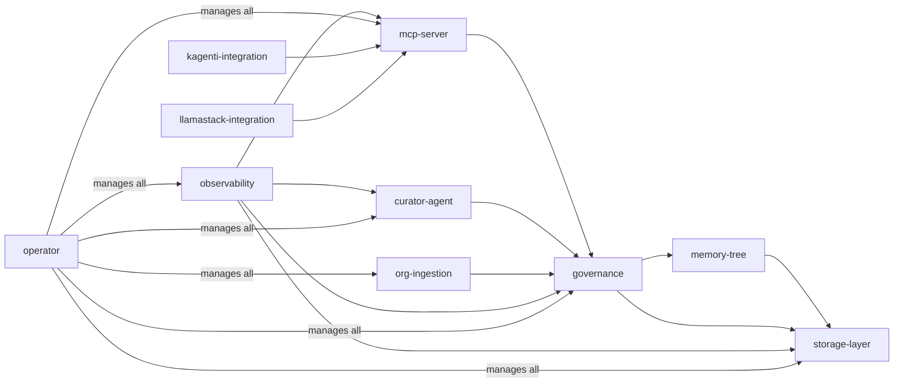

# Subsystem Inventory

MemoryHub is composed of ten subsystems. This document is the map -- each subsystem gets a name, a description, a link to its detailed design doc, and an honest status indicator.

| Subsystem | Description | Doc | Status |
|-----------|-------------|-----|--------|
| memory-tree | Core data model: tree-structured memories with nodes, branches, weights, and scopes | [memory-tree.md](memory-tree.md) | Implemented |
| storage-layer | PostgreSQL + pgvector for vectors and graph relationships, MinIO for documents (deferred) | [storage-layer.md](storage-layer.md) | Implemented |
| curator-agent | Deterministic inline curation pipeline (regex scanning, embedding dedup) with three-layer rules engine. Future background agent for promotion and cross-user analysis | [curator-agent.md](curator-agent.md) | Implemented (Phase 2a) |
| governance | Access control, immutable audit trail, FIPS compliance, policy enforcement | [governance.md](governance.md) | Design |
| mcp-server | MCP interface with 12 tools: memory CRUD, semantic search, graph relationships, curation self-service | [mcp-server.md](mcp-server.md) | Implemented |
| operator | Kubernetes Operator with CRDs for lifecycle management | [operator.md](operator.md) | Skeleton |
| observability | Grafana dashboards and Prometheus metrics for memory operations | [observability.md](observability.md) | TBD |
| org-ingestion | Pipeline for scanning external sources and ingesting organizational knowledge | [org-ingestion.md](org-ingestion.md) | TBD |
| kagenti-integration | Integration with Kagenti (K8s-native agent platform): MCP connector, extension package, ContextStore | [kagenti-integration/](kagenti-integration/) | Design |
| llamastack-integration | Integration with LlamaStack (Meta's agentic API server on RHOAI): MCP tool group, Vector IO provider, distribution template | [llamastack-integration/](llamastack-integration/) | Design |

## Status definitions

**Implemented** means the subsystem is deployed and functioning on OpenShift with tests. There may be follow-up work (performance tuning, additional features), but the core capability is live.

**Design** means the core concepts are decided and documented, but implementation hasn't started. There may still be open design questions noted in the subsystem doc.

**Skeleton** means we know what the subsystem does at a high level, but significant design work remains before implementation. The doc captures intent and lists what needs to be figured out.

**TBD** means the subsystem is identified as necessary but hasn't been designed yet. The doc captures the problem space and open questions.

## Dependency graph

The subsystems aren't independent. Here's how they relate:

The memory-tree data model is foundational -- storage-layer implements it, governance enforces rules on it, and everything else consumes it. The governance engine is the chokepoint by design: every memory operation passes through it for access control and audit logging. The operator sits above everything, managing lifecycle and configuration.

## Build order

Based on dependencies, the natural implementation sequence is:

1. **memory-tree** -- define the data model, nail down the schema
2. **storage-layer** -- implement the schema in PostgreSQL + MinIO
3. **governance** -- access control and audit logging on top of storage
4. **mcp-server** -- expose governance-backed operations to agents
5. **curator-agent** -- automated memory management
6. **org-ingestion** -- external knowledge pipeline
7. **observability** -- metrics and dashboards (can start earlier for basic metrics)
8. **operator** -- CRDs and reconciliation (can start in parallel once CRD design is done)

The operator and observability subsystems can be developed in parallel with the core path since they're largely orthogonal to the data flow implementation.
