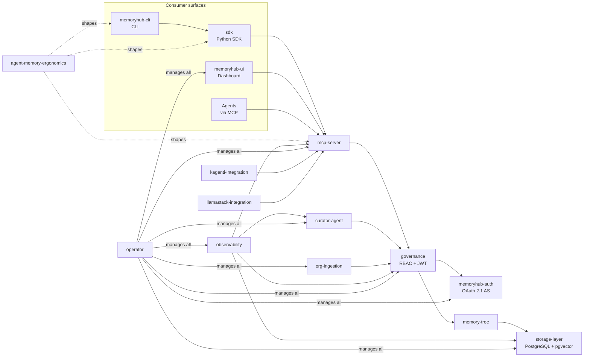

# Subsystem Inventory

MemoryHub is composed of fourteen subsystems. This document is the map -- each subsystem gets a name, a description, a link to its detailed design doc (where one exists), and an honest status indicator.

| Subsystem | Description | Doc | Status |
|-----------|-------------|-----|--------|
| memory-tree | Core data model: tree-structured memories with nodes, branches, weights, and scopes | [memory-tree.md](memory-tree.md) | Implemented |
| storage-layer | PostgreSQL + pgvector for vectors and graph relationships, MinIO for documents (deferred) | [storage-layer.md](storage-layer.md) | Implemented |
| curator-agent | Deterministic inline curation pipeline (regex scanning, embedding dedup) with three-layer rules engine. Future background agent for promotion and cross-user analysis | [curator-agent.md](curator-agent.md) | Implemented (Phase 2a) |
| governance | Access control via service-layer RBAC (`core/authz.py`), JWT verification, OAuth 2.1 client management, campaign membership resolution (#157), immutable audit trail (audit logging stub interface tracked as #67), FIPS compliance | [governance.md](governance.md) | Implemented (RBAC + JWT shipped 2026-04-07; campaign RBAC shipped 2026-04-09; audit log + FIPS pending) |
| mcp-server | MCP interface with 15 tools: register_session, search_memory, read_memory, write_memory, update_memory, delete_memory, get_memory_history, get_similar_memories, get_relationships, create_relationship, suggest_merge, set_curation_rule, report_contradiction, set_session_focus, get_focus_history. Includes Layer 2 session focus retrieval (#58), Layer 1 search shape knobs (#56/#57), #61 session focus history, and #154 campaign scope + domain-aware retrieval | [mcp-server.md](mcp-server.md) | Implemented |
| memoryhub-auth | Standalone OAuth 2.1 authorization server (FastAPI). Supports `client_credentials` and `refresh_token` grants, RSA-2048 JWT signing, JWKS endpoint, admin client management API, DB-backed refresh token rotation | _embedded in `memoryhub-auth/`_ | Implemented |
| sdk | Typed Python client SDK published to PyPI as `memoryhub`. Wraps every MCP tool, manages OAuth tokens transparently, auto-discovers `.memoryhub.yaml` project config, applies `retrieval_defaults` to outbound calls | [`sdk/README.md`](../sdk/README.md) | Implemented (v0.1.0) |
| memoryhub-cli | Terminal client (`pip install memoryhub-cli`). `memoryhub search/read/write/delete/history` for memory operations; `memoryhub config init` for generating project-level `.memoryhub.yaml` and `.claude/rules/memoryhub-loading.md` rule files | _embedded in `memoryhub-cli/`_ | Implemented |
| memoryhub-ui | Dashboard: React + PatternFly 6 frontend behind a FastAPI BFF, shipped as a single container with an OAuth-proxy sidecar. Six panels: Memory Graph, Status Overview, Users & Agents, Client Management, Curation Rules, Contradiction Log | _embedded in `memoryhub-ui/`_ | Implemented |
| agent-memory-ergonomics | Cross-cutting design effort that defined search-response shape, session focus / two-vector retrieval with cross-encoder reranking, and the project-config + rule-generation surface. Layer 1 (#56/#57), Layer 2 (#58), and Layer 3 (#59/#60/#73) all shipped 2026-04-07. Phase 2 follow-ups: #61 (focus history), #62 (Pattern E push) | [agent-memory-ergonomics/](agent-memory-ergonomics/) | Implemented (Layers 1-3); Phase 2 open |
| operator | Kubernetes Operator with CRDs for lifecycle management | [planning/operator.md](../planning/operator.md) | Skeleton |
| observability | Grafana dashboards and Prometheus metrics for memory operations | [planning/observability.md](../planning/observability.md) | TBD |
| org-ingestion | Pipeline for scanning external sources and ingesting organizational knowledge | [planning/org-ingestion.md](../planning/org-ingestion.md) | TBD |
| kagenti-integration | Integration with Kagenti (K8s-native agent platform): MCP connector, extension package, ContextStore | [planning/kagenti-integration/](../planning/kagenti-integration/) | Design |
| llamastack-integration | Integration with LlamaStack (Meta's agentic API server on RHOAI): MCP tool group, Vector IO provider, distribution template | [planning/llamastack-integration/](../planning/llamastack-integration/) | Design |

## Status definitions

**Implemented** means the subsystem is deployed and functioning on OpenShift with tests. There may be follow-up work (performance tuning, additional features), but the core capability is live.

**Design** means the core concepts are decided and documented, but implementation hasn't started. There may still be open design questions noted in the subsystem doc.

**Skeleton** means we know what the subsystem does at a high level, but significant design work remains before implementation. The doc captures intent and lists what needs to be figured out.

**TBD** means the subsystem is identified as necessary but hasn't been designed yet. The doc captures the problem space and open questions.

## Dependency graph

The memory-tree data model is foundational -- storage-layer implements it, governance enforces rules on it, and everything else consumes it. The governance engine is the chokepoint by design: every memory operation passes through it for access control and audit logging. The mcp-server is the sole entry point into the service layer; the SDK, CLI, dashboard, and agents are all just different surfaces calling into it. The operator sits above everything, managing lifecycle and configuration.

The agent-memory-ergonomics subsystem is cross-cutting rather than load-bearing -- it shaped the response format of `search_memory`, the parameters the SDK exposes, and the project-config + rule-generation flow in the CLI, but it does not own its own runtime component. Its outputs landed inside the existing subsystems.

## Deployment topology

The deployed system spans three OpenShift namespaces:

| Namespace | Pods | Purpose |
|---|---|---|
| `memory-hub-mcp` | `memory-hub-mcp` (FastMCP server), `memoryhub-ui` (BFF + oauth-proxy sidecar) | Agent-facing MCP server and the dashboard. Co-located so the BFF can call MCP over the cluster network with low latency. |
| `memoryhub-auth` | `auth-server` | Standalone OAuth 2.1 authorization server. Issues JWTs consumed by the MCP server's `JWTVerifier` and by the BFF's admin proxy. |
| `memoryhub-db` | `memoryhub-pg-0` | PostgreSQL with the pgvector extension. Backs all relational, vector, and graph queries. |

External RHOAI services that MemoryHub depends on but does not own:

- **Embedding model** — `all-MiniLM-L6-v2` deployed via vLLM, 384-dimensional embeddings. URL configured via `MEMORYHUB_EMBEDDING_URL`.
- **Cross-encoder reranker** — `ms-marco-MiniLM-L12-v2` deployed via vLLM. Optional; the focus-path retrieval (#58) gracefully falls back to plain pgvector cosine when `MEMORYHUB_RERANKER_URL` is unset or unreachable.

## What's not yet shipped

- **operator** is a skeleton. CRDs for memory tiers, policies, and storage configuration are designed but not implemented. The current deployment is plain manifests + scripts.
- **observability** is TBD. There are no Prometheus metrics or Grafana dashboards yet; the dashboard's "Observability" panel is intentionally disabled (#10).
- **org-ingestion** is TBD. The pipeline for scanning external sources is unscoped.
- **Phase 2 of agent-memory-ergonomics** -- #61 (session focus history as a usage signal) and #62 (Pattern E real-time push notifications) are both unblocked by #58 but not yet started. Both will need a Valkey-backed store for session focus vectors.
- **Audit logging** for governance is a stub interface (#67), not yet wired through.
- **FIPS compliance** is inherited from the cluster's FIPS mode but has not been validated end-to-end.
