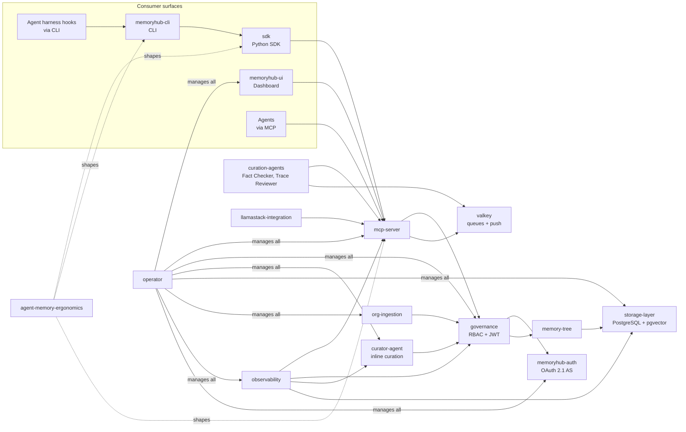

# Subsystem Inventory

MemoryHub is composed of the subsystems below (currently eighteen — keep this table, not this sentence, as the source of truth). This document is the map -- each subsystem gets a name, a description, a link to its detailed design doc (where one exists), and an honest status indicator.

| Subsystem | Description | Doc | Status |
|-----------|-------------|-----|--------|
| memory-tree | Core data model: tree-structured memories with nodes, branches, weights, and scopes. Content type system (#237) classifies memories as experiential/knowledge/behavioral for graduation workflow and agent reconstruction. Workflow checkpoint (#238) provides durable state for recurring agents | [memory-tree.md](design/memory-tree.md) | Implemented |
| storage-layer | PostgreSQL + pgvector for relational, vector, and graph queries; MinIO for object/document storage (deployed — see [storage-layer.md](design/storage-layer.md); used for compaction cold storage and spill archiving) | [storage-layer.md](design/storage-layer.md) | Implemented |
| curator-agent | Deterministic inline curation pipeline (regex scanning, embedding dedup) with three-layer rules engine. PII rule escalated to block (#234). Entity extraction Phase 2 (#170) via spaCy NER with POLE+O entity types, content-addressed IDs (#247), async background task, feature-flagged. Future background agent for promotion and cross-user analysis | [curator-agent.md](design/curator-agent.md) | Implemented (Phase 2a) |
| governance | Access control via service-layer RBAC (`core/authz.py`), JWT verification, OAuth 2.1 client management, campaign membership resolution (#157), project auto-enrollment (#188) with project-scope membership enforcement (#64) in the claims pipeline, memory promotion (#235) with scope escalation and derived_from provenance, structured audit logging stub (#67) with JSON events on all tool call sites, actor_id/driver_id identity columns (#66), OBO authorization for service agents (#284), tenant-scoped admin API (#105), FIPS compliance | [governance.md](design/governance.md) | Implemented (audit log shipped 2026-06-30; project membership enforcement shipped 2026-06-30; OBO + tenant admin shipped 2026-06-30; FIPS pending) |
| conversation-threads | First-class governed conversation thread persistence (#168). Append-only message storage with scope/tenant isolation, RBAC, retention policies. Asynchronous extraction pipeline produces memory nodes with provenance. Fork, cross-agent handoff with A2A compatibility, handoff redaction. 4-level deletion hierarchy with cascade modes and legal hold. Daily retention sweep CronJob | [conversation-persistence.md](design/conversation-persistence.md) | Implemented |
| mcp-server | MCP interface with 4 tools in compact profile (default): `register_session` + `memory` action-dispatch with 28 actions (#201/#202, #219) + `thread` action-dispatch with 9 actions (#168) + `admin_memory` (#45). Full profile (13 tools, flat parameters) via `MEMORYHUB_TOOL_PROFILE=full`. Minimal profile (5 tools) for constrained contexts. Source of truth for counts: `memory-hub-mcp/src/main.py` | [mcp-server.md](design/mcp-server.md) | Implemented |
| memoryhub-auth | Standalone OAuth 2.1 authorization server (FastAPI). Supports `client_credentials` and `refresh_token` grants, RSA-2048 JWT signing, JWKS endpoint, admin client management API, DB-backed refresh token rotation | _embedded in `memoryhub-auth/`_ | Implemented |
| sdk | Typed Python client SDK published to PyPI as `memoryhub`. Wraps every MCP operation, manages OAuth tokens transparently, auto-discovers `.memoryhub.yaml` project config, applies `retrieval_defaults` to outbound calls. v0.13.0 adds 9 async thread methods (`create_thread`, `append_message`, `get_thread`, `list_threads`, `archive_thread`, `extract_thread`, `fork_thread`, `share_thread`, `delete_thread`) with typed response models and sync wrappers. Extraction pipeline (#240) observes agent traces and proposes candidate memories via pluggable Extractor ABC with 4 built-in extractors. Obsidian export (#245) produces markdown with wikilinks, YAML frontmatter, and scope/entity tags | [`sdk/README.md`](../sdk/README.md) | Implemented (v0.13.0) |
| memoryhub-cli | Terminal client (`pip install memoryhub-cli`). Feature parity with MCP tool surface (#199): `memoryhub search/read/write/update/delete/history` plus `graph relate/list/similar`, `curation report/resolve/rule`, `project create/list/add-member/remove-member`, `session focus/focus-history/status`, `promote`, `checkpoint`, `reconstruct`. v0.10.0 adds `memoryhub thread create/append/get/list/archive/extract/fork/share/delete` subcommands (#168). `--output json` flag on all commands for agent consumption (#200). `--version` flag (#165). `memoryhub config init` for generating project-level `.memoryhub.yaml` and `.claude/rules/memoryhub-loading.md` rule files. `memoryhub export obsidian` (#245) for markdown export with wikilinks | _embedded in `memoryhub-cli/`_ | Implemented |
| memoryhub-ui | Dashboard: React + PatternFly 6 frontend behind a FastAPI BFF, shipped as a single container with an OAuth-proxy sidecar. Six panels: Memory Graph, Status Overview, Users & Agents, Client Management, Curation Rules, Contradiction Log | _embedded in `memoryhub-ui/`_ | Implemented |
| agent-memory-ergonomics | Cross-cutting design effort that defined search-response shape, session focus / two-vector retrieval with cross-encoder reranking, and the project-config + rule-generation surface. Layer 1 (#56/#57), Layer 2 (#58), and Layer 3 (#59/#60/#73) all shipped 2026-04-07. Phase 2 follow-ups: #61 (focus history), #62 (Pattern E push) | [agent-memory-ergonomics/](agent-memory-ergonomics/) | Implemented (Layers 1-3); Phase 2 open |
| curation-agents | Shared agent framework (`memoryhub-agents` package) with plugin architecture for four curation agents: Fact Checker (#287, temporal expiry + calendar verification), Trace Reviewer (#288, post-session memory extraction with OBO ownership), Curator (#285, deep dedup + staleness + conflict detection), Statistician (#289, population-level pattern aggregation with SDC). Valkey-backed job queues, leader election for singletons, MCP client with exponential backoff retry | [planning/autonomous-curation-agents.md](../planning/autonomous-curation-agents.md) | Implemented (framework + Fact Checker + Trace Reviewer); Curator + Statistician pending |
| admin-moderation | Content moderation for incident response: memory status model (active/quarantined/soft_deleted), cross-owner admin search with regex, quarantine/restore operations, hard delete with sanitized audit mode for classified data spills (#45). MCP `admin_memory` tool with `memory:admin` scope enforcement | [admin/content-moderation.md](admin/content-moderation.md) | Implemented |
| temporal-awareness | Semantic expiry via `relevant_until` column (#282) with heuristic temporal classifier (explicit deadlines, relative phrases, implicit markers). Search-time `temporal_status` filter (current/expired/expiring_soon). Within-user pattern surfacing (#292) detects memory clusters during search and annotates responses with `pattern_signals` | [two-vector-retrieval.md](design/two-vector-retrieval.md) | Implemented |
| operator | Kubernetes Operator with CRDs for lifecycle management | [planning/operator.md](../planning/operator.md) | Skeleton |
| observability | Grafana dashboards and Prometheus metrics for memory operations | [planning/observability.md](../planning/observability.md) | TBD |
| org-ingestion | Pipeline for scanning external sources and ingesting organizational knowledge | [planning/org-ingestion.md](../planning/org-ingestion.md) | TBD |
| llamastack-integration | Integration with LlamaStack (Meta's agentic API server on RHOAI): MCP tool group, Vector IO provider, distribution template | [planning/llamastack-integration/](../planning/llamastack-integration/) | Design |

## Status definitions

**Implemented** means the subsystem is deployed and functioning on OpenShift with tests. There may be follow-up work (performance tuning, additional features), but the core capability is live.

**Design** means the core concepts are decided and documented, but implementation hasn't started. There may still be open design questions noted in the subsystem doc.

**Skeleton** means we know what the subsystem does at a high level, but significant design work remains before implementation. The doc captures intent and lists what needs to be figured out.

**TBD** means the subsystem is identified as necessary but hasn't been designed yet. The doc captures the problem space and open questions.

## Dependency graph

```mermaid
graph LR
    subgraph "Consumer surfaces"
        SDK[sdk<br/>Python SDK]
        CLI[memoryhub-cli<br/>CLI]
        UI[memoryhub-ui<br/>Dashboard]
        AGENT[Agents<br/>via MCP]
        HOOKS[Agent harness hooks<br/>via CLI]
    end

    MCP[mcp-server]
    GOV[governance<br/>RBAC + JWT]
    AUTH[memoryhub-auth<br/>OAuth 2.1 AS]
    MT[memory-tree]
    SL[storage-layer<br/>PostgreSQL + pgvector]
    CUR[curator-agent<br/>inline curation]
    CURA[curation-agents<br/>Fact Checker, Trace Reviewer]
    VK[valkey<br/>queues + push]
    ERG[agent-memory-ergonomics]
    ING[org-ingestion]
    OBS[observability]
    OP[operator]

    SDK --> MCP
    CLI --> SDK
    HOOKS --> CLI
    UI --> MCP
    AGENT --> MCP

    MCP --> GOV
    GOV --> AUTH
    GOV --> MT
    MT --> SL
    CUR --> GOV
    CURA --> MCP
    CURA --> VK
    MCP --> VK
    ING --> GOV
    ERG -.shapes.-> MCP & SDK & CLI

    OBS --> MCP & GOV & CUR & SL
    OP -->|manages all| MCP & GOV & CUR & SL & ING & OBS & UI & AUTH

    LS[llamastack-integration] --> MCP
```

The memory-tree data model is foundational -- storage-layer implements it, governance enforces rules on it, and everything else consumes it. The governance engine is the chokepoint by design: every memory operation passes through it for access control and audit logging. The mcp-server is the sole entry point into the service layer; the SDK, CLI, dashboard, and agents are all just different surfaces calling into it, and new surfaces (agent plugins, platform connectors) attach the same way — over MCP or via the SDK, never directly against the database (see the "Consumer surfaces" section in [ARCHITECTURE.md](ARCHITECTURE.md)). The operator sits above everything, managing lifecycle and configuration.

The agent-memory-ergonomics subsystem is cross-cutting rather than load-bearing -- it shaped the response format of `search_memory`, the parameters the SDK exposes, and the project-config + rule-generation flow in the CLI, but it does not own its own runtime component. Its outputs landed inside the existing subsystems.

## Deployment topology

The deployed system spans five OpenShift namespaces:

| Namespace | Pods | Purpose |
|---|---|---|
| `memory-hub-mcp` | `memory-hub-mcp` (FastMCP server), `memoryhub-ui` (BFF + oauth-proxy sidecar), `memoryhub-valkey` (Valkey 8.0), `fact-checker` (CronJob, daily) | Agent-facing MCP server, the dashboard, and job queues/push. Co-located so the BFF and agents can call MCP over the cluster network with low latency. |
| `memoryhub-storage` | `memoryhub-minio` (MinIO) | S3-compatible object storage for oversized memory content. Isolated in its own namespace so data survives MCP server reinstalls (#395). |
| `memoryhub-agents` | `trace-reviewer` (Deployment) | Background curation agents with a different scaling profile (HPA-eligible, continuous); reaches Valkey cross-namespace via `memoryhub-valkey.memory-hub-mcp.svc:6379`. |
| `memoryhub-auth` | `auth-server` | Standalone OAuth 2.1 authorization server. Issues JWTs consumed by the MCP server's `JWTVerifier` and by the BFF's admin proxy. |
| `memoryhub-db` | `memoryhub-pg-0` | PostgreSQL with the pgvector extension. Backs all relational, vector, and graph queries. |

External RHOAI services that MemoryHub depends on but does not own:

- **Embedding model** — `all-MiniLM-L6-v2` deployed via vLLM, 384-dimensional embeddings. URL configured via `MEMORYHUB_EMBEDDING_URL`.
- **Cross-encoder reranker** — `ms-marco-MiniLM-L12-v2` deployed via vLLM. Optional; the focus-path retrieval (#58) gracefully falls back to plain pgvector cosine when `MEMORYHUB_RERANKER_URL` is unset or unreachable.

## Downstream consumers

External projects that consume MemoryHub's public surfaces. Listed here so SDK and MCP API changes can be coordinated with their authors.

| Consumer | Repo | Surfaces consumed | Notes |
|---|---|---|---|
| kagenti-adk | https://github.com/kagenti/adk | `memoryhub` Python SDK + public MCP route | First known external SDK consumer. Adds a MemoryStore extension to IBM's Python ADK. |

### kagenti-adk

The IBM Python Agent Development Kit (ADK) ships a MemoryStore extension that wraps the `memoryhub` SDK. The integration baseline is `kagenti/adk` PR #231.

- **Integration points**: A2A service extension at `apps/adk-py/src/kagenti_adk/a2a/extensions/services/memoryhub.py` plus the per-context wrapper at `kagenti_adk/server/store/memoryhub_memory_store.py`.
- **SDK surface used**: `MemoryHubClient` constructor, `search`/`write`/`read`/`update`/`delete`, `WriteResult.curation.reason`, `NotFoundError`.
- **Authentication**: API key (default) or OAuth 2.1 `client_credentials`.
- **E2E tests**: gated behind `MEMORYHUB_E2E_URL` and `MEMORYHUB_E2E_API_KEY` repo secrets on `kagenti/adk`; skipped without them.
- **URL discovery**: The current MCP URL is published at `https://redhat-ai-americas.github.io/memory-hub/discovery.json` via GitHub Pages. When the sandbox cluster rotates, run `scripts/update-discovery.sh --push <new-url>` to update the discovery file. E2E tests can read this endpoint to self-heal after rotation. See `planning/kagenti-adk-e2e-cluster-url-stability.md` for the decision record.
- **Stability promise**: SDK breaking changes (renamed fields, signature changes, new exceptions on the happy path) need to be coordinated with the kagenti-adk maintainers before release.

## What's not yet shipped

- **operator** is a skeleton. CRDs for memory tiers, policies, and storage configuration are designed but not implemented. The current deployment is plain manifests + scripts.
- **observability** is TBD. There are no Prometheus metrics or Grafana dashboards yet; the dashboard's "Observability" panel is intentionally disabled (#10).
- **org-ingestion** is TBD. The pipeline for scanning external sources is unscoped.
- **Phase 2 of agent-memory-ergonomics** -- #61 (session focus history as a usage signal) and #62 (Pattern E real-time push notifications) are both unblocked by #58 but not yet started. Both will need a Valkey-backed store for session focus vectors.
- **Audit logging** for governance is a stub interface (#67), not yet wired through.
- **FIPS compliance** is inherited from the cluster's FIPS mode but has not been validated end-to-end.

**Operational tooling shipped since last update:**

- **PostgreSQL backup/restore** (#191) — `scripts/backup-db.sh` and `scripts/restore-db.sh` for standalone database dumps via `oc exec`. `uninstall-full.sh` prompts for pre-uninstall backup unless `--skip-db` or `--no-backup` is passed. `deploy-full.sh` accepts `--restore-from <file>`.
