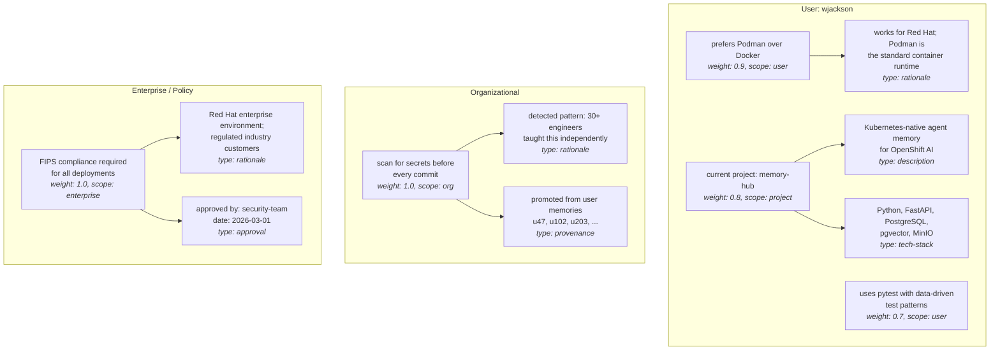

# Memory Tree: Core Data Model

The central architectural idea in MemoryHub is that memories form a tree, not a flat list or a layered stack. This matters because it determines how memories are stored, retrieved, and injected into agent context.

## Why a tree?

The alternative we rejected was a "layer cake" -- flat tiers stacked on top of each other (recent, organizational, personal, soul, etc.), each tier a separate bucket with separate retrieval logic. The problem with that model is that it doesn't capture relationships between memories or allow graceful depth control. A flat list either gives you everything or nothing.

The tree model solves this by making every memory a node with potential child branches. An agent searching for memories gets back nodes at the appropriate depth -- full content for high-priority nodes, stubs for the rest. The stub signals "there's more here if you need it," and the agent can crawl deeper on demand. This keeps context windows lean while making depth available.

## Node structure

Every memory is a node with these properties:

**Content** is the actual memory text. "Prefers Podman over Docker." For stub injection, the system generates a compressed summary; for full injection, the content is used as-is.

**Weight** is a float between 0 and 1 that controls injection behavior. High-weight nodes (close to 1.0) get their full content injected. Low-weight nodes get stubs. The weight threshold for full vs. stub injection is configurable per deployment. Weight is not relevance -- it's priority. A memory can be highly relevant to a search query but still injected as a stub if its weight is low.

**Scope** determines who can access the memory and what governance rules apply. See the scopes section below.

**Branches** are child nodes. Some are optional (like rationale), others could be required by policy (like provenance for organizational memories). A node can have zero or many branches.

**Version metadata** includes an `isCurrent` flag, creation timestamp, last-modified timestamp, and a reference to the previous version if this node was updated. See the versioning section below.

**Embedding** is the vector representation stored in pgvector for semantic search. Generated at write time.

## Example tree

Here's a concrete example showing several memory types and how they relate:

When an agent queries for context about a container build task, the search might return:
- M1 as a full injection (weight 0.9, relevant to containers)
- O1 as a full injection (weight 1.0, always relevant to commits)
- E1 as a full injection (weight 1.0, policy)
- M2 as a stub (weight 0.7, tangentially relevant)

The agent sees the stubs and can decide: "I'm doing a container build, not writing tests -- I don't need to expand M2." That decision saves tokens and keeps the context focused.

## Memory scopes

Scopes form a hierarchy from personal to enterprise-wide. Each scope has different governance rules for who can read, write, and manage memories within it.

**User scope** is personal to one user. "Prefers dark mode." "Uses vim keybindings." Fully automatic creation -- the agent writes these without human approval. Only the owning user can hand-edit them. No other human or agent can modify a user-scoped memory, because if they could, they could change what an agent does on behalf of a user and frame that user for the outcome. This is a security property, not just a UX choice.

**Project scope** is shared within a project context. "This project uses FastAPI." "The API endpoints follow this naming convention." Scoped to a project identifier, accessible to all agents working in that project. Automatic creation, auditable.

**Role scope** applies to a job function. "Platform engineers should check resource limits on all deployments." Accessible to all agents whose users have that role. Automatic creation with audit capability.

**Organizational scope** represents patterns detected across users. "This organization prefers Podman." Created by the curator agent when it detects convergence in user-level memories. Requires provenance tracking back to source memories. Automatic creation, but auditable and reversible.

**Enterprise/policy scope** is mandated rules. "FIPS compliance required." "All API keys must be rotated every 90 days." These always require human-in-the-loop for creation and modification. They're the highest authority -- an agent should never override an enterprise memory based on a user preference.

## Rationale branches

Any memory node can have an optional rationale branch. This is one of MemoryHub's distinguishing features.

The rationale answers "why does this memory exist?" or "why does this preference hold?" It's stored as a child node of the memory it explains, not as a field on the memory itself. This matters because rationale can be arbitrarily deep -- a rationale node could itself have branches with supporting evidence, historical context, or links to source documents.

Rationale is not injected by default. The parent node's stub includes an indicator that rationale is available. The agent decides whether to retrieve it based on the task at hand. If someone asks "why do we use Podman?", the agent expands the rationale branch. If the agent is just doing a container build, the preference alone is sufficient.

This design means memory injection stays lean by default while supporting deep context when agents need it.

## Versioning

Every memory node carries version metadata:

**isCurrent** is a boolean flag. Only one version of a memory is current at any time. Older versions are preserved but not surfaced in normal queries.

**Version history** links each version to its predecessor. "Prefers Python" (v1, not current) -> "Prefers Rust for systems, Python for scripting" (v2, current). The full chain is traversable for forensics.

**Timestamps** on each version enable temporal queries. "What did agent X believe about wjackson's language preference on March 15th?" is answered by finding the version that was current at that timestamp.

This version model is the foundation for two capabilities:

**Forensics**: reconstructing exactly what an agent knew at any point in time. When an incident investigation asks "why did the agent do X?", you can reconstruct the memory state that influenced the decision.

**Staleness detection**: when an agent observes behavior that contradicts a stored memory, it can prompt for revision. "You said you prefer Podman, but you've been using Docker in your last three projects. Want to update this?" The version history shows whether this is a real change in preference or a temporary exception.

## Weight calibration

How weights get assigned is an open design question. Several approaches are on the table, and we'll likely use a combination:

**Scope-based defaults**: enterprise/policy memories default to weight 1.0 (always inject full content). User memories default to something lower, like 0.7.

**Relevance modulation**: the search system could temporarily boost a node's effective weight based on how relevant it is to the current query, while the base weight stays unchanged.

**Decay**: weights could decay over time if a memory is never accessed, signaling potential staleness.

**Agent-set weights**: the writing agent could suggest a weight at creation time ("this is critical" vs. "this is a minor preference").

The right answer is probably scope-based defaults with relevance modulation at query time. But this needs prototyping to get the feel right -- it directly affects how useful agents find the memory injection.

## Schema Design

**Status: TBD.** The PostgreSQL schema for representing the tree is one of the first implementation tasks. Key considerations:

The tree structure could be represented with adjacency lists (each node has a `parent_id`), nested sets, or materialized paths. Adjacency lists are simplest and work well for trees where depth is bounded (memory trees aren't deeply nested). Apache AGE adds openCypher query support which could make traversal queries more natural, but we need to validate AGE works with the OOTB PostgreSQL operator.

Embeddings are stored via pgvector and queried with vector similarity operators. The embedding column sits on the node table alongside the tree structure columns.

MinIO stores the full content for document-sized memories. The PostgreSQL node row holds a reference (S3 key) instead of the content itself. For shorter memories, content lives directly in PostgreSQL.

## Design Questions

- What's the maximum practical depth of the tree? Rationale branches are typically one level deep, but provenance chains could go deeper. Should we cap depth?
- How do we handle cross-tree references? A project memory might reference an organizational memory. Is that a branch, a link, or a separate relationship type?
- Should the embedding be on the node content only, or should it incorporate branch content (e.g., rationale) for richer semantic matching?
- What's the stub format? A truncated version of the content? A separately authored summary? A structured indicator with metadata?
