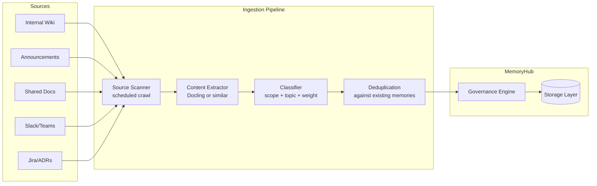

# Organizational Memory Ingestion

The org-ingestion subsystem scans external sources -- documents, announcements, knowledge bases -- and feeds organizational knowledge into MemoryHub's memory tree. This is how the organization's collective knowledge stays current without requiring every user to manually teach their agent.

**Status: TBD.** This subsystem is identified as necessary but has not been designed beyond the problem space. The notes below capture intent and open questions.

## The Problem

Organizational knowledge lives in many places: internal wikis, Slack/Teams channels, email announcements, Confluence pages, shared documents, Jira tickets, runbooks, architecture decision records. Today, agents don't have access to any of this unless a user manually copies it into a memory or a RAG pipeline surfaces it at query time.

Org ingestion bridges this gap by actively scanning organizational sources, extracting knowledge, classifying it by scope and topic, and storing it as organizational memories in MemoryHub. The result: an agent helping a new hire already knows about last week's architecture decision, without anyone having to teach it.

## Conceptual Pipeline

### Source scanning

A scheduled crawler connects to configured organizational sources and identifies new or updated content since the last scan. Each source type needs a connector: wiki APIs, email APIs, document storage APIs, messaging platform APIs. The scan schedule is configurable per source.

### Content extraction

Raw content from sources needs to be processed into clean text suitable for memory storage. Docling (the standard document processing library in our stack) handles document parsing. For structured sources like wikis or Jira, the extraction is more about selecting the relevant fields than parsing document formats.

### Classification

Extracted content needs to be classified along several dimensions: what scope does this belong to (organizational, role-specific, project-specific)? What topic does it relate to? What weight should it carry? Is it a fact, a policy, a recommendation, or a reference?

This is where an LLM likely comes in. Rule-based classification can handle obvious cases (an email from the security team about a new policy is enterprise-scope), but nuanced classification ("is this architecture decision relevant to all teams or just the platform team?") requires judgment.

### Deduplication

Before storing, the pipeline checks whether the extracted knowledge already exists in MemoryHub -- either as an identical memory or as a semantically equivalent one. Vector similarity search (pgvector) handles the semantic comparison. If a match is found, the pipeline either skips the ingestion or updates the existing memory with new information.

## Integration Points

The ingestion pipeline writes to MemoryHub through the governance engine, just like every other write path. This means ingested memories go through access control, secrets scanning, and audit logging. The pipeline doesn't get a backdoor.

For above-user-level writes, the pipeline's writes go through the curator agent's queue. The curator checks for conflicts with existing organizational memories before committing.

Source connectors need authentication to the external systems they scan. These credentials are stored as OpenShift Secrets and mounted into the ingestion pod. The credentials themselves should never appear in memory content (the secrets scanner would catch this, but prevention is better than detection).

## Design Questions

This subsystem has more open questions than answers at this stage.

- **Source prioritization**: which sources do we build connectors for first? Internal wikis and shared documents are probably the highest value. Slack/Teams channels are high volume but noisy -- how do we filter signal from noise?
- **Freshness vs. volume**: scanning frequently catches changes faster but generates more load. What's the right balance? Should different sources have different scan frequencies?
- **Classification quality**: how good does LLM-based classification need to be before we trust it for automatic organizational memory creation? Should all ingested memories start as "proposed" and require human review?
- **Change detection**: how do we handle updates to source documents? If a wiki page is edited, do we update the corresponding memory, create a new version, or re-evaluate whether it's still relevant?
- **Scope boundaries**: some organizational knowledge is sensitive to specific teams. How do we determine scope from source metadata? A document in the "security-team" Confluence space might be role-scoped to security engineers, not organization-wide.
- **Content granularity**: a long document might contain multiple distinct pieces of knowledge. Do we ingest it as one memory or chunk it into multiple memories? Chunking strategy matters for retrieval quality.
- **Feedback loop**: when users find ingested memories unhelpful or wrong, how does that signal get back to the ingestion pipeline to improve future ingestion?
- **Rate of change**: some sources update frequently (Slack channels), others rarely (architecture decision records). The pipeline needs to handle both without overwhelming the system with updates from chatty sources.
- **Licensing and access**: do we have the right to ingest content from all configured sources? This seems obvious, but some enterprise knowledge bases have access restrictions that might not extend to automated ingestion.
- **Document processing**: Docling is the standard for document processing. Do we also need specialized handlers for structured data (Jira issues, Git commits, CI/CD pipeline logs)?
