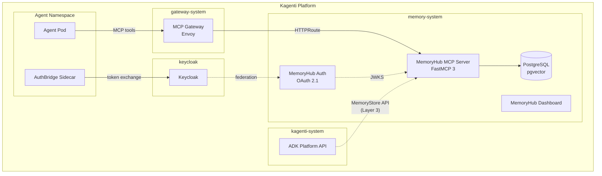
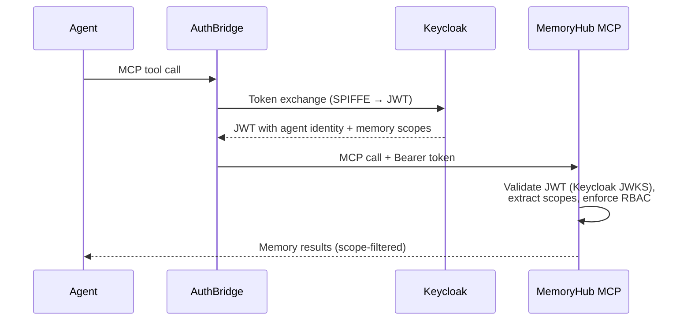

# Governed Agent Memory Services for Kagenti

**Date:** 2026-04-22
**Status:** Draft (Layer 3 validated via PoC 2026-04-23; Layer 1 gateway blocked)
**Authors:** Wes Jackson (Red Hat)

## Problem Statement

Kagenti provides strong infrastructure for deploying and operating AI agents on Kubernetes — identity, networking, observability, and lifecycle management — but its memory model is minimal by design. The ADK's `ContextStore` (in `kagenti_adk.server.store`) provides per-context conversation replay, and the `VectorStore` (in `kagenti_adk.platform`) provides per-agent embedding search via the Platform API, but neither is designed for the broader memory problem that production agent deployments face:

- **Cross-session continuity.** Agents lose all learned preferences, decisions, and context when a conversation ends. The next session starts from zero.
- **Cross-agent knowledge sharing.** Agents on the same platform cannot share what they learn. One agent's discovery of a user preference or a project constraint stays siloed.
- **Memory governance.** There is no mechanism to control what agents remember, enforce retention policies, detect contradictions between memories, or scope visibility by role or organizational boundary.
- **Provenance and rationale.** When an agent acts on a remembered fact, there is no record of where that fact came from, who asserted it, or why it was retained.

The `InMemoryContextStore` default means most agents today lose all state on pod restart, and the platform does not yet address memory governance or cross-agent knowledge sharing.

This proposal introduces **governed agent memory** as an optional platform service in Kagenti, filling the gap between the existing context store (conversation replay) and what production agents need (durable, scoped, searchable, governed knowledge).

## Goals

1. Give every Kagenti-deployed agent access to persistent, governed memory through standard platform patterns — no agent code changes required for basic tool access via the MCP Gateway.
2. Provide memory scoping that aligns with Kagenti's multi-namespace tenant model — agents see memories appropriate to their identity and organizational context.
3. Preserve Kagenti's framework-neutral stance — the memory service works with any agent framework, not just ADK-wrapped agents.
4. Keep the memory service optional — Kagenti installations that don't need governed memory should not pay for it.
5. Maintain the memory service as a standalone project that can be deployed independently of Kagenti, so it remains useful for non-Kagenti environments (standalone OpenShift AI, LlamaStack, custom platforms).

## Non-Goals

- Replacing the existing `ContextStore`. Conversation replay and governed memory serve different purposes. The `ContextStore` handles the A2A message sequence for a single context; the memory service handles durable knowledge that persists across contexts.
- Modifying the ADK's core agent lifecycle. The integration uses existing extension points (MCP connectors, dependency injection), not new framework abstractions.
- Embedding model management. The memory service brings its own embedding pipeline and does not depend on Kagenti's model serving infrastructure, though it can optionally use RHOAI-managed models if available.

## User Stories

**Platform Engineer:** "I want to add persistent memory to our Kagenti installation so agents retain context across sessions. I should be able to enable it with a Helm value and have it integrate with our existing Keycloak for identity."

**Application Developer:** "I'm building an agent with LangGraph on Kagenti. I want my agent to remember user preferences and project decisions without writing a custom persistence layer. I should be able to call memory tools via MCP like any other tool."

**Operations Engineer:** "I need to audit what agents have stored, enforce data retention policies, and ensure agents in one team's namespace can't read another team's memories."

## Background: MemoryHub

MemoryHub is an existing open-source project (Apache 2.0, [github.com/redhat-ai-americas/memory-hub](https://github.com/redhat-ai-americas/memory-hub)) that implements governed agent memory for Kubernetes. It is deployed on OpenShift AI today. The core architecture:

- **Tree-structured memories** with typed branches (rationale, provenance) — the "why" behind a memory is preserved alongside the "what," with full version history on every update.
- **Scope hierarchy and RBAC** — `user`, `project`, `campaign`, `organizational`, `enterprise` scopes with service-layer enforcement, project enrollment, and graph relationships between memories.
- **Semantic search** — pgvector embeddings with optional cross-encoder reranking and session-focus retrieval for topic-aware ranking.
- **Curation pipeline** — configurable rules for contradiction detection, deduplication, and content scanning.
- **MCP interface** consumed by agents, plus a typed Python SDK, CLI, and PatternFly 6 dashboard.

The MCP interface makes it framework-neutral — any agent that can call MCP tools can use it. MemoryHub ships its own OAuth 2.1 authorization server for standalone deployments; in a Kagenti context, this would be replaced by Keycloak federation (see Layer 2), eliminating the need for a second identity provider. The auth server already supports RFC 8693 token exchange, which aligns with AuthBridge's token propagation model.

## Proposal

### Integration Architecture

The integration has three layers, ordered from lowest coupling to deepest. Each layer is independently useful — a Kagenti installation can adopt layer 1 alone and get value, or go deeper for tighter integration.



### Layer 1: MCP Gateway Registration

**Scope:** Zero changes to Kagenti. Zero changes to MemoryHub. Pure configuration.

MemoryHub's MCP server is deployed in its own namespace (`memory-system`) and registered with Kagenti's MCP Gateway using the standard `MCPServerRegistration` CRD:

```yaml
apiVersion: gateway.networking.k8s.io/v1
kind: HTTPRoute
metadata:
  name: memoryhub-route
  namespace: memory-system
  labels:
    mcp-server: "true"
spec:
  parentRefs:
  - name: mcp-gateway
    namespace: gateway-system
  rules:
  - matches:
    - path:
        type: PathPrefix
        value: /
    backendRefs:
    - name: memory-hub-mcp
      port: 8000
---
apiVersion: mcp.kagenti.com/v1alpha1
kind: MCPServerRegistration
metadata:
  name: memoryhub-tools
  namespace: memory-system
spec:
  toolPrefix: memory_
  targetRef:
    group: gateway.networking.k8s.io
    kind: HTTPRoute
    name: memoryhub-route
    namespace: memory-system
  credentialRef:
    key: token
    name: memoryhub-gateway-token
```

Any agent on the platform — regardless of framework — can then discover and call MemoryHub's tools (`memory_search_memory`, `memory_write_memory`, etc.) through the standard `MCP_URL` endpoint.

**What this gives you:** Every agent gains access to governed memory. The MCP Gateway handles routing. Agents use their existing MCP client patterns. No new abstractions to learn.

**What it doesn't give you:** Identity propagation. At this layer, all agents authenticate to MemoryHub with a shared gateway credential. Memory scoping works (agents can self-declare their identity via `register_session`), but it's trust-based rather than cryptographically enforced.

> **PoC finding (2026-04-23):** Gateway-mediated registration is currently blocked. The MCP Gateway's Istio listeners use dev-oriented hostnames (`mcp.127-0-0-1.sslip.io`, `*.mcp.local`), and Istio rejects HTTPRoutes that don't match (kagenti/kagenti#1275). Direct MCP connections (agent pod → MemoryHub service URL, bypassing the gateway) work today and are the recommended path for initial deployments. The `MCPServerRegistration` API group is confirmed as `mcp.kagenti.com/v1alpha1` (not `mcp.kuadrant.io`). Additionally, the `path` field defaults to `/mcp` — MemoryHub serves at `/mcp/` (with trailing slash) so this must be set explicitly.

### Layer 2: Identity Integration via Keycloak Federation

**Scope:** Changes to MemoryHub's auth server to accept Keycloak-issued tokens. Configuration changes in Keycloak. No changes to Kagenti core.

Kagenti already solves the "who is this agent?" problem with SPIFFE/SPIRE and Keycloak. MemoryHub already solves the "who can see this memory?" problem with OAuth 2.1 and RBAC scopes. Layer 2 connects these two systems so that agent identity flows through to memory authorization without agents needing to manage separate credentials.

Two approaches, depending on operational preference:

**Option A — Keycloak as trusted issuer (recommended).** MemoryHub's MCP server accepts Keycloak-issued tokens directly by adding Keycloak's JWKS endpoint to its list of trusted issuers. MemoryHub registers as a resource server (client) in Keycloak with the appropriate memory scopes. Agents authenticate to Keycloak (which they already do via AuthBridge), and the resulting token is accepted by MemoryHub — no second auth server needed.



**Option B — RFC 8693 token exchange.** AuthBridge exchanges the agent's Keycloak token for a MemoryHub-specific token via the `token_exchange` grant that MemoryHub already supports. This keeps the two token domains separate but requires an additional network hop.

In either case, the mapping from Keycloak roles to MemoryHub scopes is configured in Keycloak's client mapper:

| Keycloak Role | MemoryHub Scope |
|---|---|
| `memoryhub-reader` | `memory:read` |
| `memoryhub-writer` | `memory:read memory:write` |
| `memoryhub-admin` | `memory:read memory:write memory:admin` |

Kagenti's namespace-based tenant isolation maps naturally to MemoryHub's project scope — agents in the same namespace share project-scoped memories, agents in different namespaces don't see each other's project memories unless the project's enrollment policy allows it.

**What this gives you:** Cryptographically enforced memory RBAC based on the agent's actual identity. No shared credentials. Memory visibility aligns with Kagenti's tenant model.

### Layer 3: ADK Platform Integration

**Scope:** New code in the ADK. A `MemoryStore` abstraction and a MemoryHub-backed implementation. Feature-flagged, disabled by default.

This layer makes governed memory a first-class ADK runtime service alongside the existing `ContextStore`. The `MemoryStore` would live in `kagenti_adk.server.store` — the same package as `ContextStore` — because both are server-side store abstractions with the same Protocol + ABC pattern and `create(context_id)` factory shape. (This is distinct from the `VectorStore` in `kagenti_adk.platform`, which is a Platform API client model.) ADK-wrapped agents get memory access through dependency injection without importing any MemoryHub-specific code.

The MemoryHub team would contribute and maintain this code. The kagenti team's review obligation is limited to the protocol definition and DI wiring; the `MemoryHubMemoryStore` implementation is a thin MCP client wrapper.

```python
# New protocol in kagenti_adk.server.store
class MemoryStoreInstance(Protocol):
    """Long-term governed memory for an agent."""

    async def search(
        self,
        query: str,
        *,
        scope: str | None = None,
        project_id: str | None = None,
        limit: int = 10,
    ) -> list[MemoryResult]: ...

    async def write(
        self,
        content: str,
        *,
        scope: str = "user",
        weight: float = 0.7,
        tags: list[str] | None = None,
    ) -> str: ...  # returns memory_id

    async def read(self, memory_id: str) -> Memory | None: ...

    async def update(
        self,
        memory_id: str,
        content: str,
        *,
        change_note: str | None = None,
    ) -> None: ...

    async def delete(self, memory_id: str) -> None: ...


class MemoryStore(abc.ABC):
    @property
    def required_extensions(self) -> set[str]:
        return set()

    @abc.abstractmethod
    async def create(self, context_id: str) -> MemoryStoreInstance: ...
```

The `MemoryHubMemoryStore` implementation calls MemoryHub's MCP server directly over HTTP using an `httpx.AsyncClient`, authenticated with the agent's Keycloak-issued Bearer token. It does not route through the ADK Platform API — MemoryHub is a peer service, not a Platform API extension:

```python
class MemoryHubMemoryStore(MemoryStore):
    """MemoryStore backed by MemoryHub MCP server."""

    def __init__(self, memoryhub_url: str):
        self.memoryhub_url = memoryhub_url

    async def create(self, context_id: str) -> MemoryHubMemoryStoreInstance:
        return MemoryHubMemoryStoreInstance(
            context_id=context_id,
            memoryhub_url=self.memoryhub_url,
        )
```

Agents access it via the standard DI pattern:

```python
from kagenti_adk.server.store import MemoryStoreInstance

async def my_agent_handler(
    memory: Annotated[MemoryStoreInstance, Depends(get_memory_store_instance)],
    context: Annotated[ContextStoreInstance, Depends(get_context_store_instance)],
):
    # Search for relevant memories
    prefs = await memory.search("user deployment preferences")

    # Write a new memory
    await memory.write(
        "User prefers Podman over Docker for container builds",
        scope="user",
        weight=0.9,
    )
```

> **PoC finding (2026-04-23):** This DI pattern has been validated end-to-end. Memory write, semantic search recall, and pod restart survival all confirmed. One caveat: ADK's `Depends.__call__` is synchronous and does not `await` async callables (kagenti/adk#229). The workaround is a synchronous callable returning a lazy proxy (`_MemoryProxy`) that defers async MCP client setup to first use. Implementation on branch `feat/memory-store-protocol` on `rdwj/adk`.

The `ContextStore` and `MemoryStore` remain separate abstractions with different lifecycles:

| Concern | ContextStore | MemoryStore |
|---|---|---|
| Scope | Single conversation context | Cross-session, cross-agent |
| Content | A2A Messages and Artifacts | Structured knowledge with metadata |
| Lifecycle | Created and destroyed with context | Persists indefinitely (governed) |
| Search | Sequential replay | Semantic (embedding + rerank) |
| Access control | Context owner only | RBAC with scope hierarchy |
| Versioning | Append-only | Full version history |

### Helm Chart Integration

MemoryHub deploys as an optional subchart of `kagenti-deps`, gated by a feature flag:

```yaml
# values.yaml
memoryhub:
  enabled: false
  # When enabled, deploys:
  #   - PostgreSQL with pgvector (memory-system namespace)
  #   - MCP server (memory-system namespace)
  #   - Auth server (memory-system namespace, or federated to Keycloak)
  #   - Dashboard (memory-system namespace, optional)
  #   - MCPServerRegistration for gateway integration
  #   - Keycloak client + role configuration (if identity integration enabled)
  identity:
    provider: "keycloak"  # or "standalone"
  dashboard:
    enabled: true
  embedding:
    # Can use RHOAI-managed models or deploy its own
    url: ""  # auto-detected from RHOAI if empty
```

When `memoryhub.enabled: true`, the installer:
1. Creates the `memory-system` namespace
2. Deploys PostgreSQL with pgvector
3. Deploys the MemoryHub MCP server
4. Registers the MCP server with the gateway (Layer 1)
5. If `identity.provider: "keycloak"`, configures Keycloak federation (Layer 2)
6. If the ADK is installed, enables the `MemoryStore` feature flag (Layer 3)

### Dashboard Integration

MemoryHub ships its own dashboard (React + PatternFly 6) that can either run standalone or be linked from Kagenti's UI. The integration options are:

1. **Standalone route.** MemoryHub dashboard gets its own OpenShift Route, accessible from Kagenti's UI via a sidebar link. This is the simplest option and preserves the dashboard's existing functionality (Memory Graph, Status Overview, Users & Agents, Client Management, Curation Rules, Contradiction Log).

2. **Embedded panels.** Individual dashboard panels (particularly the Memory Graph and Curation Rules panels) are exposed as microfrontend modules that Kagenti's UI can embed. This requires frontend coordination but provides a more integrated experience.

Option 1 is recommended for the initial integration. Option 2 can follow if there's demand.

## Decisions

| Decision | Choice | Rationale |
|---|---|---|
| Integration model | Optional platform service, not core dependency | Kagenti installations that don't need governed memory shouldn't pay for it |
| Memory abstraction | New `MemoryStore` protocol, separate from `ContextStore` | Different lifecycle, different access patterns, different governance requirements |
| Identity integration | Keycloak federation (Option A) preferred | Avoids an extra token exchange hop; aligns with Kagenti's existing Keycloak-centric model |
| Namespace | Dedicated `memory-system` namespace | Follows Kagenti's pattern of separate namespaces per service concern |
| Standalone viability | MemoryHub remains an independent project | Must work without Kagenti for non-Kagenti environments (RHOAI, LlamaStack, custom) |
| Feature flag | `memoryhub.enabled: false` by default | Optional component, disabled by default |

## Risks and Open Questions

**MCP Gateway transport compatibility.** ~~MemoryHub uses streamable-HTTP (the current MCP transport standard). The MCP Gateway is Envoy-based and routes HTTP traffic, so this should work, but it has not been validated.~~ **Validated 2026-04-23:** The transport itself is not the issue. The blocker is that the MCP Gateway's Istio listeners are configured with dev hostnames, causing Istio to reject HTTPRoutes for external services. Direct MCP connections work. Filed as kagenti/kagenti#1275. This remains the highest-priority item for Layer 1 gateway-mediated registration.

**SPIRE workload identity.** MemoryHub pods in `memory-system` will need SPIRE entries for workload identity. This is likely handled automatically by the kagenti operator's namespace onboarding, but has not been tested in the PoC (deferred to Layer 2 validation).

**ADK API stability.** The ADK is pre-1.0 and the `ContextStore` interface may change. The `MemoryStore` protocol proposed in Layer 3 mirrors the current `ContextStore` pattern; if that pattern changes, `MemoryStore` would need to follow. This risk is mitigated by the MemoryHub team owning the implementation code. **Additional ADK concern (PoC):** `Depends.__call__` does not `await` async callables (kagenti/adk#229). The lazy proxy workaround is functional but the underlying bug should be fixed in the ADK.

**Resource footprint.** MemoryHub requires PostgreSQL with pgvector and an embedding model endpoint. On a cluster already running RHOAI, the embedding model can be shared. PostgreSQL resource requirements are modest (1 CPU, 2 GiB RAM for typical workloads, storage scaling with memory count). Detailed sizing guidance will be included in the Helm chart documentation.

**Multi-cluster.** This proposal covers single-cluster deployment. Cross-cluster memory federation (agents in cluster A accessing memories from cluster B) is out of scope and would require a separate design if needed.

## Alignment with Kagenti Patterns

| Pattern | Kagenti Convention | MemoryHub Alignment |
|---|---|---|
| Service deployment | Helm subchart in `kagenti-deps` | Optional subchart, gated by feature flag |
| Identity | Keycloak + SPIRE | Keycloak federation or token exchange |
| Tool access | MCP Gateway + `MCPServerRegistration` | Standard MCP registration |
| ADK integration | Protocol + ABC in `server.store`, DI via `Depends` | `MemoryStore` protocol + DI |
| Multi-tenancy | Namespace isolation | Project scope maps to namespace |
| Observability | Phoenix / OTEL | OTEL-compatible metrics (planned) |
| Feature flags | Disabled by default | `memoryhub.enabled: false` |
| License | Apache 2.0 | Apache 2.0 |

## Implementation Horizons

### Short-Term (Layer 1 — configuration only)

- [ ] Helm template for MemoryHub deployment in `memory-system` namespace
- [ ] `MCPServerRegistration` and `HTTPRoute` for gateway integration — **blocked** by kagenti/kagenti#1275 (gateway hostname config)
- [ ] Documentation: "Adding governed memory to your Kagenti installation" — direct MCP connection path can be documented now
- [ ] Example agent demonstrating memory tool usage via direct MCP connection (gateway path deferred)

### Medium-Term (Layer 2 — identity integration)

- [ ] Keycloak client configuration for MemoryHub
- [ ] Role-to-scope mapper in Keycloak
- [ ] MemoryHub auth server: accept Keycloak JWKS as trusted issuer
- [ ] AuthBridge configuration for memory service token propagation
- [ ] Integration test: agent identity flows through to memory RBAC

### Long-Term (Layer 3 — ADK integration)

- [x] `MemoryStore` protocol definition in `kagenti_adk.server.store` — **validated in PoC**, branch `feat/memory-store-protocol` on `rdwj/adk`
- [x] `MemoryHubMemoryStore` implementation — **validated in PoC** (write, search, read, pod restart survival)
- [ ] ADK Platform API: `/api/v1/memory/` endpoints (proxied to MemoryHub)
- [ ] Feature flag in ADK Helm chart
- [ ] ADK documentation update
- [ ] Fix ADK `Depends` async issue (kagenti/adk#229) to remove lazy proxy workaround

## Next Steps

1. Review this proposal with Kagenti maintainers for architectural fit
2. ~~Validate MCP Gateway transport compatibility~~ — **Done** (PoC 2026-04-23). Transport works; gateway hostname configuration is the blocker (kagenti/kagenti#1275)
3. ~~Prototype Layer 1 on a shared cluster~~ — **Done** (PoC). Direct connection validated; gateway registration blocked. PRs submitted: kagenti/kagenti#1322, kagenti/kagenti#1323
4. Submit ADK MemoryStore PR from `feat/memory-store-protocol` branch
5. If accepted, open tracking issues in `kagenti/kagenti` for each implementation horizon
